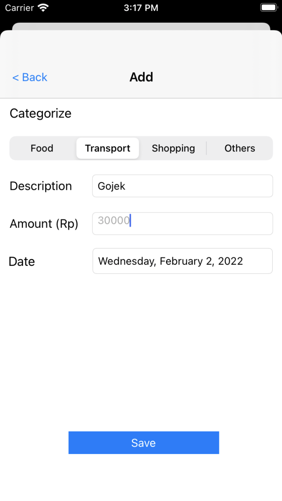
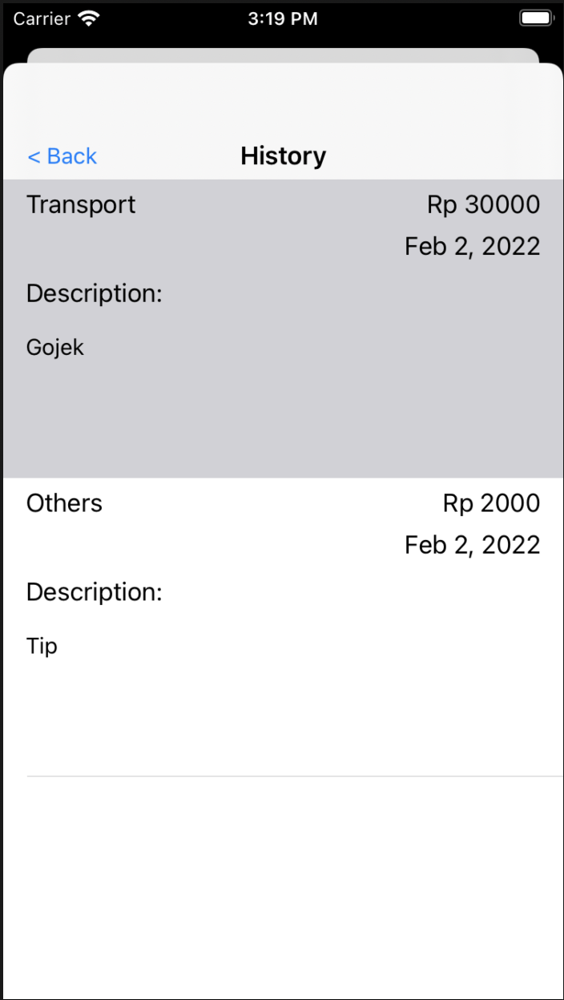
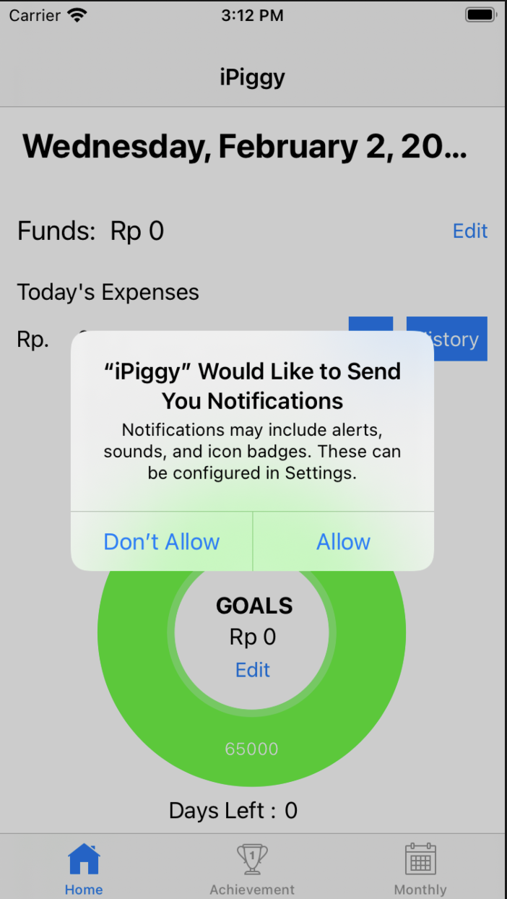
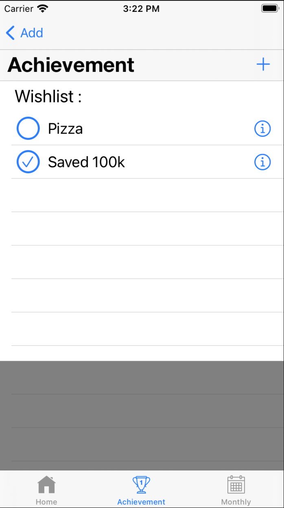

# iPiggy

An iPhone app used to manage your personal finances, with the goal of saving up money.

<b>Features:</b>
- Set money saving goal within a period amount of time.
- A diagram that shows the progress of how much money do you have to save more in order to reach your goal.
- For every transaction you record, the diagram gets updated.
- A recommended spending for the day is calculated in order to help you achieve your goal.
- A calendar system that shows your wishlists.
- Achievements
- Uses SQLlite to store data

    
Screenshots

    
    &nbsp
    
    &nbsp
    
    &nbsp
    
    &nbsp
    
    &nbsp
    
    &nbsp
    
    &nbsp
    

